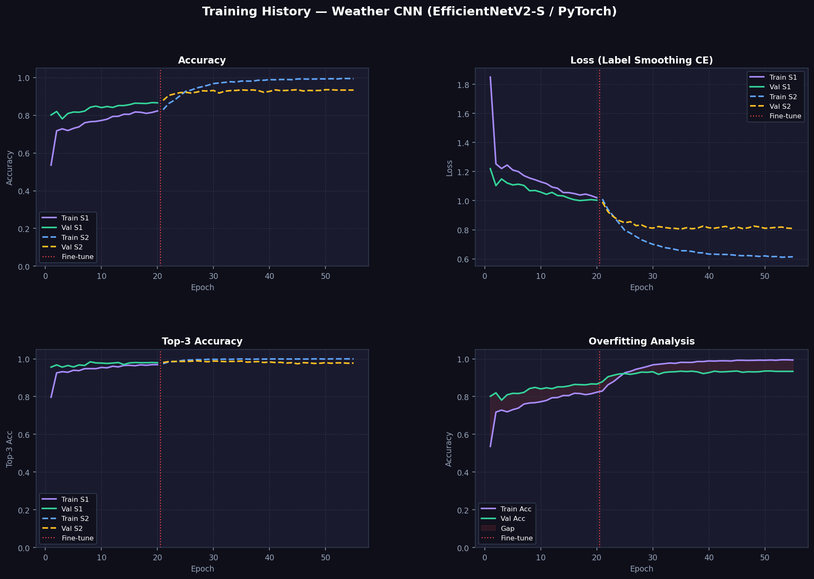
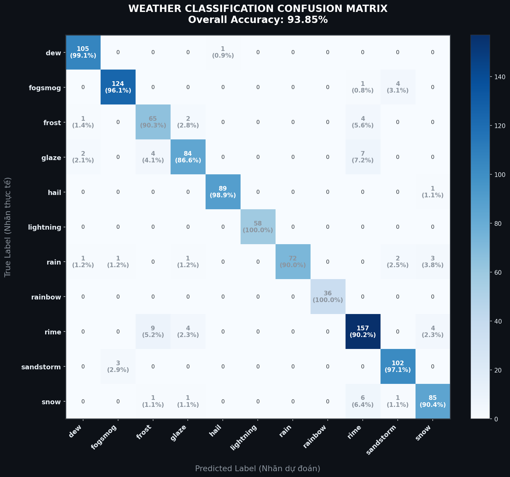

# 🌦️ WeatherVision AI — Nhận Diện Và Phân Tích Thời Tiết Đa Nguồn

Hệ thống trí tuệ nhân tạo nhận diện **11 hiện tượng thời tiết từ ảnh**, giải thích vùng ảnh ảnh hưởng đến quyết định bằng **Grad-CAM**, đồng thời tra cứu thời tiết theo vị trí và dự báo nguy cơ mưa trong **3, 6 và 12 giờ tiếp theo**.

Dự án sử dụng **EfficientNetV2-S, PyTorch, OpenCV, Streamlit và Open-Meteo API**.

## 👤 Người thực hiện

| Họ và tên | MSSV |
|---|---|
| **Ngô Long Thiên** | **2001230920** |

## 🚀 Tính năng chính

### 🧠 Nhận diện hiện tượng thời tiết

- Nhận diện 11 lớp: `dew`, `fogsmog`, `frost`, `glaze`, `hail`, `lightning`, `rain`, `rainbow`, `rime`, `sandstorm` và `snow`
- Hiển thị **Top 3 dự đoán** cùng xác suất
- Cho phép điều chỉnh **ngưỡng tin cậy**
- Cảnh báo khi ảnh có độ tin cậy thấp
- Tự động sử dụng GPU CUDA khi thiết bị hỗ trợ

### 🔍 Giải thích mô hình

- Sinh bản đồ nhiệt bằng **Grad-CAM**
- Hiển thị vùng ảnh ảnh hưởng mạnh nhất đến quyết định
- Hỗ trợ kiểm tra mô hình có tập trung đúng vào hiện tượng thời tiết hay không

### 🌍 Thời tiết theo vị trí

- Tìm kiếm thành phố bằng tên tiếng Việt hoặc tiếng Anh
- Hiển thị nhiệt độ, cảm giác thực, độ ẩm, tốc độ gió và lượng mưa
- Dự báo xác suất mưa sau **3 giờ, 6 giờ và 12 giờ**
- Biểu đồ xác suất mưa trong 12 giờ tiếp theo
- Bảng dự báo thời tiết 7 ngày
- Đối chiếu tham khảo giữa kết quả AI từ ảnh và thời tiết trực tuyến

### 📊 Huấn luyện và đánh giá

- Transfer Learning với EfficientNetV2-S
- Huấn luyện hai giai đoạn: đóng băng backbone và fine-tune toàn mạng
- Data augmentation, AdamW, label smoothing và cosine scheduler
- Đánh giá Accuracy, Precision, Recall, F1-score và Confusion Matrix
- Hỗ trợ export model sang ONNX
- Có unit test và GitHub Actions kiểm tra chất lượng source

## 📈 Kết quả mô hình

| Chỉ số | Kết quả |
|---|---:|
| Accuracy | **93,85%** |
| Macro Precision | **94,58%** |
| Macro Recall | **94,43%** |
| Macro F1-score | **94,45%** |
| Weighted F1-score | **93,86%** |
| Số ảnh test | **1.041** |
| Số lớp | **11** |

### Biểu đồ huấn luyện WeatherVision AI

<p align="center">
  
</p>

Biểu đồ thể hiện quá trình huấn luyện hai giai đoạn, bao gồm Accuracy, Loss, Top-3 Accuracy và mức chênh lệch giữa tập huấn luyện với tập validation.

### Ma trận nhầm lẫn WeatherVision AI

<p align="center">
  
</p>

Mô hình đạt độ chính xác tổng thể **93,85%**. Các lớp `lightning` và `rainbow` đạt Recall 100%, trong khi một số lớp có đặc điểm gần giống nhau như `frost`, `glaze`, `rime` và `snow` vẫn có thể bị nhầm lẫn.

## 🛠️ Công nghệ sử dụng

| Thành phần | Công nghệ |
|---|---|
| Ngôn ngữ | Python |
| Deep Learning | PyTorch, Torchvision |
| Kiến trúc mô hình | EfficientNetV2-S |
| Kỹ thuật huấn luyện | Transfer Learning, Fine-tuning |
| Giải thích mô hình | Grad-CAM |
| Xử lý ảnh | OpenCV, Pillow |
| Giao diện | Streamlit |
| Weather API | Open-Meteo |
| Xử lý dữ liệu | NumPy, Pandas |
| Đánh giá | Scikit-learn, Matplotlib |
| Tối ưu triển khai | ONNX |
| Kiểm thử | Pytest, GitHub Actions |

## ⚙️ Hướng dẫn cài đặt

### Yêu cầu

- Python 3.10 hoặc mới hơn
- Git
- GPU NVIDIA hỗ trợ CUDA là tùy chọn
- Kết nối Internet để sử dụng chức năng dự báo theo vị trí

### 1. Clone repository

```bash
git clone https://github.com/Thienshinn1608/WeatherVision-AI.git
cd WeatherVision-AI
```

### 2. Tạo môi trường ảo

Windows CMD:

```cmd
python -m venv .venv
.venv\Scripts\activate
```

Git Bash:

```bash
python -m venv .venv
source .venv/Scripts/activate
```

### 3. Cài đặt thư viện

```bash
python -m pip install --upgrade pip
pip install -r requirements.txt
```

### 4. Chạy ứng dụng

```bash
streamlit run app.py
```

Sau đó mở trình duyệt tại:

```text
http://localhost:8501
```

## 🏋️ Huấn luyện lại mô hình

Dataset sử dụng cấu trúc `ImageFolder`:

```text
data/
├── train/
│   ├── dew/
│   ├── fogsmog/
│   ├── frost/
│   ├── glaze/
│   ├── hail/
│   ├── lightning/
│   ├── rain/
│   ├── rainbow/
│   ├── rime/
│   ├── sandstorm/
│   └── snow/
├── val/
└── test/
```

Huấn luyện:

```bash
python train.py --data data --batch-size 16
```

Đánh giá:

```bash
python evaluate.py --data data/test
```

Export ONNX:

```bash
python export_onnx.py
```

## 📁 Cấu trúc thư mục

```text
WeatherVision-AI/
├── app.py                              # Dashboard Streamlit
├── train.py                            # Huấn luyện mô hình
├── evaluate.py                         # Đánh giá mô hình
├── export_onnx.py                      # Export model sang ONNX
├── class_names.json                    # Danh sách 11 lớp
├── weather_model.pth                   # Trọng số mô hình đã huấn luyện
├── requirements.txt                    # Danh sách thư viện
├── requirements-dev.txt                # Thư viện phát triển và kiểm thử
├── pyproject.toml                      # Cấu hình dự án Python
├── src/
│   └── weathervision/
│       ├── __init__.py
│       ├── config.py                   # Cấu hình và metadata
│       ├── model.py                    # Kiến trúc EfficientNetV2-S
│       ├── predictor.py                # Pipeline suy luận
│       ├── gradcam.py                  # Tạo Grad-CAM
│       └── weather_api.py              # Tích hợp Open-Meteo API
├── docs/
│   ├── training_charts.png             # Biểu đồ huấn luyện
│   ├── confusion_matrix.png            # Ma trận nhầm lẫn
│   └── evaluation_report.md            # Báo cáo đánh giá
├── tests/
│   └── test_weather_codes.py           # Unit test
└── .github/
    └── workflows/
        └── quality.yml                 # GitHub Actions
```

> Nếu model của bạn đang nằm trong `models/weather_model.pth` thay vì thư mục gốc, hãy giữ nguyên vị trí đó và chỉnh dòng cấu trúc phía trên cho đúng với repo thực tế.

## 👨‍💻 Nội dung thực hiện

- Fine-tune EfficientNetV2-S để phân loại 11 hiện tượng thời tiết
- Xây dựng pipeline tiền xử lý và suy luận ảnh
- Triển khai Top-3 prediction và kiểm tra ngưỡng tin cậy
- Tích hợp Grad-CAM để giải thích quyết định của mô hình
- Xây dựng dashboard Streamlit
- Tích hợp Open-Meteo để lấy dữ liệu thời tiết theo vị trí
- Xây dựng chức năng dự báo nguy cơ mưa sau 3, 6 và 12 giờ
- Đánh giá mô hình bằng Accuracy, Precision, Recall, F1-score và Confusion Matrix
- Hỗ trợ huấn luyện lại, đánh giá, kiểm thử và export ONNX

## ⚠️ Giới hạn

- Mô hình chỉ nhận diện những lớp đã xuất hiện trong tập huấn luyện
- Kết quả có thể giảm khi ảnh mờ, thiếu sáng hoặc chứa nhiều hiện tượng cùng lúc
- Các lớp có đặc điểm hình ảnh gần giống nhau có thể bị nhầm lẫn
- Grad-CAM chỉ thể hiện vùng chú ý, không phải bounding box chính xác
- Dữ liệu dự báo theo vị trí phụ thuộc Open-Meteo và kết nối Internet
- Kết quả chỉ phục vụ mục đích học tập, nghiên cứu và tham khảo

---

**Người thực hiện: Ngô Long Thiên — MSSV 2001230920**
